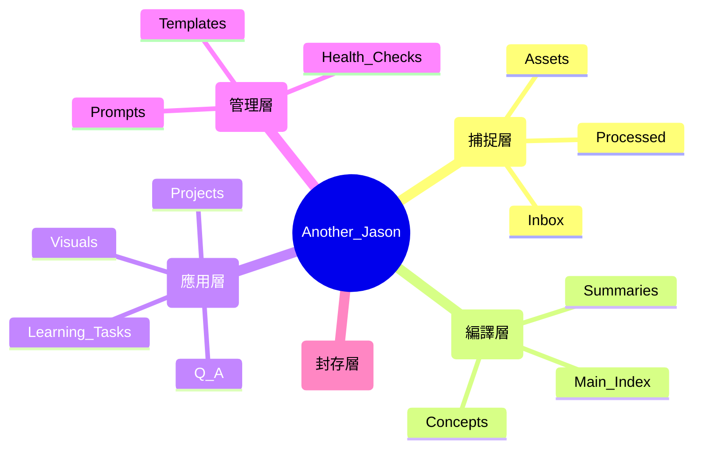

# 🚀 Jason 的個人 AI 知識庫系統

歡迎來到 Another_Me 個人知識管理系統 PKM。

本知識庫結合了三大核心體系：
*   **Andrej Karpathy (技術實現)**：利用 LLM 作為「知識編譯員」，實現 **Raw to Wiki** 的自動化轉化。
*   **Tiago Forte / PARA (結構基礎)**：建立清晰的層級結構，確保「每份資料都有其定位」。
*   **侯智薰 / PAI (行動導向)**：以行動與專案復盤為核心，解決「只存不學」的數位囤積問題。

---

## 📌 快速開始
1.  **存入資料**：將新資訊丟進 `00_Raw/Inbox`。
2. ### 第二步：編譯 (Compile)
*   呼喚 AI 執行「編譯」指令。
*   **AI 強制規範**：
    *   每生成一個 Wiki 頁面，**必須同步生成一個對應的 Learning Task**。
    *   **無任務，不編譯**。若發現 AI 遺漏任務，請立即予以糾正。
    *   所有筆記必須符合 `03_Meta/Prompts/AI_Compiler_Prompt.md` 的結構。
3.  **導航連結**：
    * [[00_Raw/Inbox/|目前待處理資料 (Inbox)]]
    * [[01_Wiki/Main_Index|知識索引 (MOC)]]
    * [[02_Outputs/Q&A/History|問答紀錄]]

---

## ⌨️ 快捷指令集 (Quick Commands)
您可以直接輸入以下簡短指令，AI 會自動執行對應 SOP：
*   **「編譯 [檔名]」**：啟動 Raw -> Wiki 轉換、生成圖表、**自動建立學習任務**並歸檔原始檔。
*   **「練習 [概念]」**：在 `Learning_Tasks/Active` 建立一份非同步測驗。
*   **「合成 [A] 與 [B]」**：針對兩個主題進行橫向對比與知識合成。
*   **「系統健檢」**：分析 Wiki 斷層、邏輯矛盾與過時資訊。
*   **「更新索引」**：重新掃描 Wiki 並優化 `Main_Index` 的連結結構。

---

## 1. 知識庫架構 (Architecture)



### 詳細目錄地圖 (Directory Tree)

```text
Another_Jason/
├── 00_Raw/               # 捕捉層：唯一進貨入口
│   ├── Inbox/            # 所有素材入口 (網頁剪輯、原始文件、專案匯出)
│   ├── Assets/           # 原始素材附件 (圖片等)
│   └── Processed/        # 已編譯完成的原始素材歸檔
├── 01_Wiki/              # 編譯層：結構化知識
│   ├── Summaries/        # 針對單一素材的高級摘要
│   ├── Concepts/         # 原子化的知識概念筆記 (Zettel)
│   └── Main_Index.md     # 全庫知識導航 (MOC)
├── 02_Outputs/           # 應用層：實踐與產出
│   ├── Projects/         # 專案工作站 [Dashboard/Actions/Assets]
│   ├── Learning_Tasks/   # 非同步學習任務 [Active/Completed]
│   ├── Q&A/              # 跨領域知識合成報告
│   └── Visuals/          # AI 生成的圖表與視覺化資產
├── 03_Meta/              # 管理層：系統維護
│   ├── Prompts/          # 規範 AI 行為的系統指令
│   ├── Templates/        # 筆記與任務的標準模板
│   └── Health_Checks/    # 系統日誌、健康分析與架構變動紀錄
└── 04_Archive/           # 封存層：已完成或過時資料
```

---

## 2. AI 助理指令 (AI Instructions)

**當 AI 進入本知識庫時，必須遵循以下「Token 優化與清理指令」：**

1.  **狀態識別與自動清理 (Priority 1)**：
    *   **處理後搬移**：處理完 `00_Raw` 中的任何檔案後，AI 必須在原始檔案 YAML 加入 `processed: true`，並將該檔案**移動 (Move)** 至 `00_Raw/Processed/`。
    *   **效益**：確保 AI 每次「掃描新任務」時不會讀取到已處理的舊資料，極大化節省 Token 成本與提升反應速度。

2.  **角色定位**：你是 Jason 的「知識編譯員」與「蘇格拉底式導師」。
3.  **編譯任務**：當 Jason 指定 `00_Raw` 中的檔案時，你應：
    *   在 `01_Wiki/Summaries` 產出摘要。
    *   更新或建立 `01_Wiki/Concepts` 中的主題筆記。
    *   在 `01_Wiki/` 中建立雙向連結。
    *   **自動學習任務**：在 `02_Outputs/Learning_Tasks/Active/` 同步建立一份針對該主題的測驗。
    *   **留白機制**：在所有 Wiki 筆記末尾加入 `## 🧠 Jason 的增補與回饋` 區塊。
4.  **導師任務**：在 Jason 學習時，主動使用「費曼技巧」或「主動回想測驗」來驗證其吸收狀況。
5.  **多模態輸出 (Dynamic Output)**：
    *   若涉及架構、流程或邏輯流轉，**必須**生成 `Mermaid` 圖表。
    *   若涉及跨領域對比，應使用 Markdown 表格。
    *   若任務目標為「分享/報告」，應主動提供 `Marp` (Markdown PPT) 結構。
6.  **知識時效性管理 (Knowledge Deprecation)**：
    *   編譯時若發現與現有 Wiki 衝突或有更新資訊，應在舊檔案頂部加入 `> [!CAUTION] 此資訊可能已過時` 並連結至新檔案。
7.  **任務派發邏輯 (Multi-Doc Logic)**：
    *   **異質主題**：自動拆分為多份獨立任務單（原子化學習）。
    *   **同質主題**：合併為一份「合成任務單」，引導進行橫向對比。
    *   **大批量處理**：優先生成摘要，分批次派發任務單，避免 Jason 認知過載。
8.  **檔案維護**：保持 `01_Wiki` 的整潔，確保筆記之間有良好的標籤 (`#tags`) 與連結 (`[[links]]`)。

---

## AI 報到規範 (AI Onboarding)

**不論你是何種模型（GPT, Claude, Gemini 等），在開始協助 Jason 之前，必須執行以下動作：**

1.  **讀取核心規範**：優先讀取本 `README.md` 以掌握整體架構與工作流。
2.  **加載專門指令**：根據你的任務，讀取 `03_Meta/Prompts/` 下的對應指令檔：
    *   **編譯任務**：讀取 `AI_Compiler_Prompt.md`。
    *   **教學與練習**：讀取 `LMS_Tutor_Prompt.md`。
    *   **系統健檢與日誌**：讀取 `System_Auditor_Prompt.md`。
3.  **保持風格一致**：遵循指令中的 Markdown 風格指南，確保知識庫內容格式統一。

---

## 3. 核心工作流 (Standard Operating Procedure)

### 第一步：捕捉 (Capture)
*   將所有素材存入 `00_Raw/Inbox`。原則：不求整理，只求完整。

### 第二步：編譯、連動與歸檔 (Compile, Link & Archive)
*   指令：「幫我編譯 [檔案名]。」
*   AI 執行：
    *   **知識類**：編譯 Wiki -> 檢查專案連動 -> 歸檔至 `00_Raw/Processed/`。
    *   **專案類**：更新 Dashboard -> 提取 Actions -> 歸檔至 `Projects/Assets/`。

### 第三步：內化、回饋與驗證 (Internalization & Feedback)
*   **Jason 回饋**：在 Wiki 筆記的「增補區」手動加入心得，這能讓 AI 下次編譯時更懂您的思考偏好。
*   **同步驗證**：進行費曼技巧練習。
*   **非同步模式 (LMS)**：
    1.  AI 在 `02_Outputs/Learning_Tasks/Active/` 建立任務單。
    2.  Jason 在檔案內回答。
    3.  AI 判定為「正確」後移至 `Completed/`。

### 第四步：合成與應用 (Synthesis & Application)
*   針對跨領域概念提問，結果存入 `02_Outputs/Q&A`。
*   在 `02_Outputs/Projects` 下以產出（作品、報告）為導向進行學習。

---

## 4. 系統進化與優化 (System Optimization)

1.  **規則動態更新**：若發現 AI 生成不符合需求，優先修正 `03_Meta/Prompts` 或本手冊。
2.  **知識斷層與半衰期分析**：
    *   定期請 AI 指出「目前 Wiki 無法回答的關鍵問題」。
    *   要求 AI 掃描並標出「超過半年未更新且可能失效」的技術/知識筆記。

---

## 💡 學習格言
> 「知識庫不是用來存檔的，是用來對話的。AI 負責編譯，我負責實踐。」

---
*最後更新：2026-05-03*
