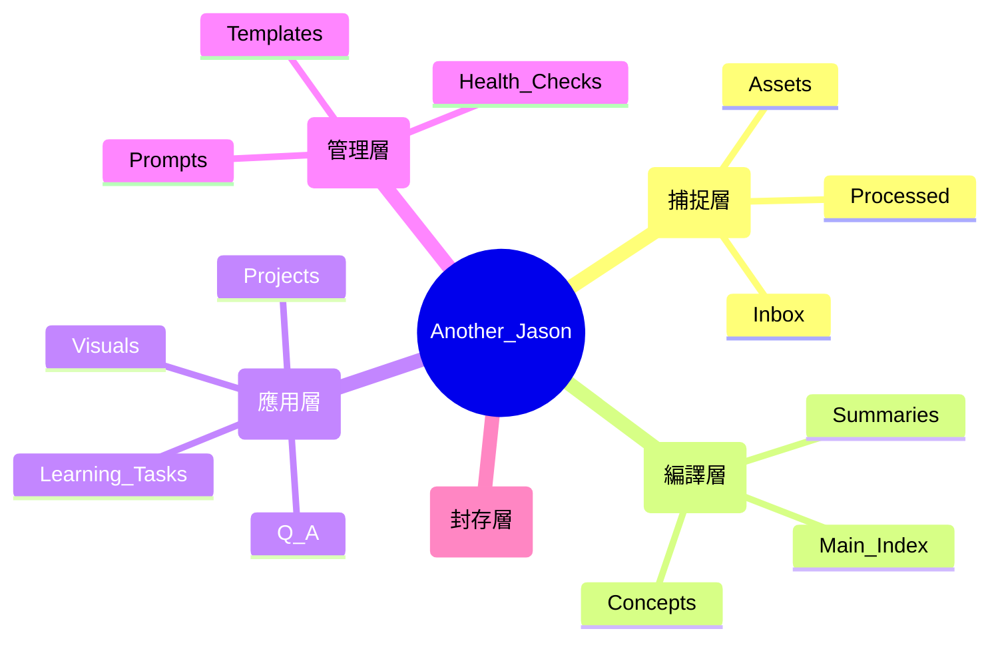

# 🚀 個人 AI 知識庫系統

> [!NOTE] 
> **最新更新 (2026-06-23, v1.2.0)**: 新增 **MIT 授權**（見 [LICENSE](./LICENSE)）與 **Notion 增量同步 SOP**（差異偵測工具，詳見第 4 節）。前次更新 (2026-05-10) 強化 `03_Meta` 管理層、新增標籤規範 `TAGS.md`、優化編譯與稽核 Prompts。詳見 [CHANGELOG.md](./CHANGELOG.md)。

歡迎來到 Another_Me 個人知識管理系統 PKM。

本知識庫結合了三大核心體系：
*   **Andrej Karpathy (技術實現)**：利用 LLM 作為「知識編譯員」，實現 **Raw to Wiki** 的自動化轉化。
*   **Tiago Forte / PARA (結構基礎)**：建立清晰的層級結構，確保「每份資料都有其定位」。
*   **侯智薰 / PAI (行動導向)**：以行動與專案復盤為核心，解決「只存不學」的數位囤積問題。

---

## 📌 快速開始
1.  **存入資料**：將新資訊丟進 `00_Raw/Inbox`。
2.  **編譯**：呼喚 AI 執行「編譯」指令。
    *   每生成一個 Wiki 頁面，**必須同步生成一個對應的 Learning Task**。
    *   **無任務，不編譯**。若發現 AI 遺漏任務，請立即予以糾正。
    *   所有筆記必須符合 `03_Meta/Prompts/AI_Compiler_Prompt.md` 的結構。
3.  **導航連結**：
    * [[00_Raw/Inbox/|目前待處理資料 (Inbox)]]
    * [[01_Wiki/Main_Index|知識索引 (MOC)]]
    * [[02_Outputs/Q&A/|問答紀錄]]

---

## ⌨️ 快捷指令集 (Quick Commands)
您可以直接輸入以下簡短指令，AI 會自動執行對應 SOP：
*   **「編譯 [檔名]」**：啟動 Raw -> Wiki 轉換、生成圖表、**自動建立學習任務**並歸檔原始檔。
*   **「會議記錄 [檔名] → [專案名]」**：萃取決策加進對應 Dashboard 的 Actions，跨專案則自動拆分。
*   **「練習 [概念]」**：在 `Learning_Tasks/Active` 建立一份非同步測驗。
*   **「批改 [任務名]」**：根據 LMS_Tutor_Prompt 對已填寫的任務單進行蘇格拉底式批改，並依結果移至 `Completed` / `Reviewing` / 留在 `Active`。
*   **「合成 [A] 與 [B]」**：針對兩個主題進行橫向對比與知識合成。
*   **「系統健檢」**：分析 Wiki 斷層、邏輯矛盾與過時資訊。
*   **「更新索引」**：重新掃描 Wiki 並優化 `Main_Index` 的連結結構。

---

## 1. 知識庫架構 (Architecture)



### 詳細目錄地圖 (Directory Tree)

```text
Another_Jason/
├── 00_Raw/               # 捕捉層：唯一進貨入口
│   ├── Inbox/            # 所有素材入口 (網頁剪輯、原始文件、專案匯出)
│   ├── Assets/           # 原始素材附件 (圖片等)
│   └── Processed/        # 已編譯完成的原始素材歸檔
├── 01_Wiki/              # 編譯層：結構化知識
│   ├── Summaries/        # 針對單一素材的高級摘要
│   ├── Concepts/         # 原子化的知識概念筆記 (Zettel)
│   └── Main_Index.md     # 全庫知識導航 (MOC)
├── 02_Outputs/           # 應用層：實踐與產出
│   ├── Projects/         # 專案工作站 [Dashboard/Actions/Assets]
│   ├── Learning_Tasks/   # 非同步學習任務 [Active/Completed]
│   ├── Q&A/              # 跨領域知識合成報告
│   └── Visuals/          # AI 生成的圖表與視覺化資產
├── 03_Meta/              # 管理層：系統維護
│   ├── Prompts/          # 規範 AI 行為的系統指令
│   ├── Templates/        # 筆記與任務的標準模板
│   └── Health_Checks/    # 系統日誌、健康分析與架構變動紀錄
└── 04_Archive/           # 封存層：已完成或過時資料
```

---

## 2. AI 助理指令 (AI Instructions)

**當 AI 進入本知識庫時，必須遵循以下「Token 優化與清理指令」：**

1.  **狀態識別與自動清理 (Priority 1)**：
    *   **知識類素材**（文章、白皮書等）：處理完後在 YAML 加入 `processed: true`，並**移動**至 `00_Raw/Processed/`。
    *   **Notion 同步檔**（專案 .md、會議記錄 .md）：處理完後直接**刪除**，不移入 Processed（詳見第 4 節 Notion 同步 SOP）。
    *   **效益**：確保 AI 每次「掃描新任務」時不會讀取到已處理的舊資料，極大化節省 Token 成本與提升反應速度。

2.  **角色定位**：你是 Jason 的「知識編譯員」與「蘇格拉底式導師」。
3.  **編譯任務**：當 Jason 指定 `00_Raw` 中的檔案時，你應：
    *   在 `01_Wiki/Summaries` 產出摘要。
    *   更新或建立 `01_Wiki/Concepts` 中的主題筆記。
    *   在 `01_Wiki/` 中建立雙向連結。
    *   **自動學習任務**：在 `02_Outputs/Learning_Tasks/Active/` 同步建立一份針對該主題的測驗。
    *   **留白機制**：在所有 Wiki 筆記末尾加入 `## 🧠 Jason 的增補與回饋` 區塊。
4.  **導師任務**：在 Jason 學習時，主動使用「費曼技巧」或「主動回想測驗」來驗證其吸收狀況。
5.  **多模態輸出 (Dynamic Output)**：
    *   若涉及架構、流程或邏輯流轉，**必須**生成 `Mermaid` 圖表。
    *   若涉及跨領域對比，應使用 Markdown 表格。
    *   若任務目標為「分享/報告」，應主動提供 `Marp` (Markdown PPT) 結構。
6.  **知識時效性管理 (Knowledge Deprecation)**：
    *   編譯時若發現與現有 Wiki 衝突或有更新資訊，應在舊檔案頂部加入 `> [!CAUTION] 此資訊可能已過時` 並連結至新檔案。
7.  **任務派發邏輯 (Multi-Doc Logic)**：
    *   **異質主題**：自動拆分為多份獨立任務單（原子化學習）。
    *   **同質主題**：合併為一份「合成任務單」，引導進行橫向對比。
    *   **大批量處理**：優先生成摘要，分批次派發任務單，避免 Jason 認知過載。
8.  **檔案維護**：保持 `01_Wiki` 的整潔，確保筆記之間有良好的標籤 (`#tags`) 與連結 (`[[links]]`)。標籤規範詳見 `03_Meta/TAGS.md`。

---

## AI 報到規範 (AI Onboarding)

**不論你是何種模型（GPT, Claude, Gemini 等），在開始協助 Jason 之前，必須執行以下動作：**

1.  **讀取核心規範**：優先讀取本 `README.md` 以掌握整體架構與工作流。
2.  **加載專門指令與規範**：根據你的任務，讀取 `03_Meta/` 下的對應指令檔與規範：
    *   **編譯任務**：讀取 `Prompts/AI_Compiler_Prompt.md`（含標籤規範引用）。
    *   **教學與練習**：讀取 `Prompts/LMS_Tutor_Prompt.md`。
    *   **系統健檢與日誌**：讀取 `Prompts/System_Auditor_Prompt.md`（含標籤審計規則）。
    *   **標籤規範**：讀取 `TAGS.md`（定義所有標籤的使用方式與命名規則）。
3.  **保持風格一致**：遵循指令中的 Markdown 風格指南與標籤規範，確保知識庫內容格式統一。

---

## 3. 核心工作流 (Standard Operating Procedure)

### 第一步：捕捉 (Capture)
*   將所有素材存入 `00_Raw/Inbox`。原則：不求整理，只求完整。

### 第二步：編譯、連動與歸檔 (Compile, Link & Archive)
*   指令：「幫我編譯 [檔案名]。」
*   AI 執行：
    *   **知識類**：編譯 Wiki → 填寫 `## 🎯 關聯專案`（Rule A）→ 歸檔至 `00_Raw/Processed/`。
    *   **專案類**：更新 Dashboard → 從 Wiki 標籤掃描相關 Concepts 填入 `## 🧠 相關 Wiki 概念`，再衍生填入 `## 🎓 相關學習任務`（Rule B）→ 歸檔至 `Projects/Assets/`。

### 第三步：內化、回饋與驗證 (Internalization & Feedback)
*   **Jason 回饋**：在 Wiki 筆記的「增補區」手動加入心得，這能讓 AI 下次編譯時更懂您的思考偏好。
*   **同步驗證**：進行費曼技巧練習。
*   **非同步模式 (LMS)**：
    1.  AI 在 `02_Outputs/Learning_Tasks/Active/` 建立任務單。
    2.  Jason 在檔案內回答。
    3.  AI 判定為「正確」後移至 `Completed/`。

### 第四步：合成與應用 (Synthesis & Application)
*   針對跨領域概念提問，結果存入 `02_Outputs/Q&A`。
*   在 `02_Outputs/Projects` 下以產出（作品、報告）為導向進行學習。

---

## 4. Notion 同步 SOP (Notion Sync)

> **開源說明**：以下 SOP 以本團隊（Dash-U）的 Notion 專案維護方式為範本。不同團隊的專案結構、版本命名規範、會議記錄格式可能不同，請依實際狀況自行客製化調整。

> 無 Notion API，以手動匯出 Markdown 為觸發點，由 Jason 自行決定同步時機。

### 第一步：你做（篩選 + 放檔）

從 Notion export 資料夾中挑出要處理的檔案：

*   **`專案/` 資料夾**：只取各專案的**頂層 .md**，略過子資料夾的 CSV。
*   **`會議記錄/` 資料夾**：略過小於 500 bytes 的空殼檔，只取有實質內容的。

選出後放進 `00_Raw/Inbox/`，建議手動去掉 Notion UUID 後綴（例如將 `KA2KA MVP demo 34115bfc....md` 改為 `KA2KA MVP demo.md`）。

### 第二步：AI 執行（依情境下指令）

| 檔案類型 | 情境 | 下給 AI 的指令 |
|---------|------|--------------|
| 專案 .md | Dashboard 已存在 | 「更新 [專案] Dashboard，參考 Inbox/[檔名]，同步進度與里程碑」 |
| 專案 .md | 新版本（v1, v2…） | 「根據 Inbox/[檔名] 建立 [專案名] 新版本 Dashboard」 |
| 會議記錄 .md | 有明確專案歸屬 | 「將 Inbox/[檔名] 的決策加進 [專案] Dashboard 的 Actions」 |
| 會議記錄 .md | 跨專案 / 全體策略 | 「將 Inbox/[檔名] 拆分至各相關專案的 Actions，每個專案各取對應部分」 |

> [!NOTE] 會議 Action 格式
> 所有 Action 檔案請依照 `03_Meta/Templates/Meeting_Action_Template.md` 建立，統一結構。

### 新版本判斷規則

若 Notion 專案頁面出現新版號（v1、v2…），且 `02_Outputs/Projects/` 中尚無對應資料夾，AI 建立新版本 Dashboard，並在 `Resources` 區塊自動連回前一版（例如 `[[KA2KA_v0_Dashboard]]`）。

### 完成後的檔案處理

> [!IMPORTANT] Notion 同步檔不進 Processed
> Notion 匯出的 .md 是**同步媒介，不是原始知識素材**。
> 處理完成後直接從 `Inbox` **刪除**，不移入 `00_Raw/Processed/`。
> `00_Raw/Processed/` 僅保留有學習價值的原始文章、白皮書等素材。

### 增量同步（差異偵測，避免每次全讀）

> 整個公司的 Notion 會「整批」重複倒進 Inbox。為避免每次都重讀 500+ 檔，
> 用 `03_Meta/Sync_State/notion_sync_diff.py` 只挑出**新增＋變更**的檔案來讀。

**原理**：Notion 檔名帶 32 位 hex 的穩定 **UUID**（同一頁面跨匯出不變），
搭配內容 **SHA-256** 偵測變動。比對鍵為 `UUID|副檔名|是否_all`（避免資料庫
主視圖 csv 與 `_all.csv` 同 UUID 碰撞）；無 UUID 的內嵌圖／媒體改用內容 hash。

**狀態檔**：`03_Meta/Sync_State/notion_manifest.json`（baseline 快照，每次同步後更新）。

**下一次同步流程**：
```bash
cd 03_Meta/Sync_State
IB="../../00_Raw/Inbox"

# 1) 先看差異（對照上次 baseline）——只列出 NEW / CHANGED / DELETED
python3 notion_sync_diff.py diff --inbox "$IB" --manifest notion_manifest.json --report last_diff.json

# 2) 只讀 last_diff.json 的 read_paths_abs（NEW+CHANGED），其餘跳過
#    依本節 SOP 更新對應 Dashboard / 拆會議 / 編譯知識

# 3) 處理完成後，更新 baseline（保留已回填的 synced_to）
python3 notion_sync_diff.py snapshot --inbox "$IB" --manifest notion_manifest.json
```

> [!TIP] 指令給 AI
> 直接說「**Notion 增量同步**」：AI 會先跑 diff，只讀差異檔，處理後自動 snapshot 更新狀態。
> 首次或想全量重檢時才說「**Notion 完整同步**」。

---

## 5. 雙向連結規則 (Bidirectional Linking Rules)

系統的核心連結邏輯，確保「工作專案」與「學習知識」互相掛鉤，詳細規範見 `03_Meta/Prompts/AI_Compiler_Prompt.md`。

| 方向 | 觸發時機 | 填寫位置 | 規則 |
|------|----------|----------|------|
| 學習 → 專案 | 編譯新知識時 | Concept 的 `## 🎯 關聯專案` | Rule A |
| 專案 → 知識 | 更新 Dashboard 時 | Dashboard 的 `## 🧠 相關 Wiki 概念` + `## 🎓 相關學習任務` | Rule B |

**Rule B 掃描邏輯（知識先，任務後）：**
1. 掃描 `01_Wiki/Concepts/` 與 `01_Wiki/Summaries/` 的 tags，找出與專案技術棧相符的條目
2. 補齊已透過 Rule A 連回本 Dashboard 但尚未列入的 Concept（消除時間差）
3. 對已連結的 Concept，若 `Learning_Tasks/Active/` 有對應衍生 Task，一併列入

> [!NOTE] 時間差說明
> 編譯新知識時，Concept 會立刻連回 Dashboard（Rule A），但 Dashboard 不會自動更新。
> AI 會在編譯後提醒你「建議下次更新 [專案] Dashboard 時執行 Rule B 補齊」。
> 下次說「更新 [專案名] Dashboard」時，Rule B 會一次補齊所有新增的 Concept。

---

## 6. 系統進化與優化 (System Optimization)

1.  **規則動態更新**：若發現 AI 生成不符合需求，優先修正 `03_Meta/Prompts` 或本手冊。
2.  **知識斷層與半衰期分析**：
    *   定期請 AI 指出「目前 Wiki 無法回答的關鍵問題」。
    *   要求 AI 掃描並標出「超過半年未更新且可能失效」的技術/知識筆記。

---

## 📜 授權 (License)

本知識庫**框架**（README、`03_Meta/` 下的 Prompts／Templates／TAGS，以及 `03_Meta/Sync_State/notion_sync_diff.py` 工具）以 **MIT License** 釋出，歡迎自由使用、修改與散布，詳見 [LICENSE](./LICENSE)。

> [!NOTE] 授權範圍
> 個人／團隊的實際筆記內容（`00_Raw`、`01_Wiki`、`02_Outputs`、`04_Archive`，以及 `03_Meta` 下的同步狀態資料與健檢日誌）已由 `.gitignore` 排除，**不在授權與公開範圍內**。

---

*最後更新：2026-06-23 (v1.2.0：新增 MIT 授權與 Notion 增量同步 SOP)*
